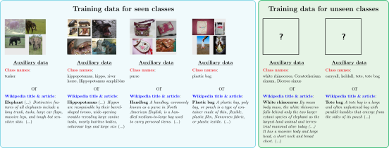

# ImageNet-Wiki Dataset

ImageNet-Wiki Dataset contains a set of correspondences between ImageNet classes (1000 standard classes from ILSVRC 2012 + 500 classes from _mp500_ from "ImageNet-21K") and Wikipedia articles.
We also share both the corresponding Wikipedia article titles; and extracted and parsed text from the articles for convenience.

<a href="https://bujwid.eu/p/zsl-imagenet-wiki">

</a>

## Wikipedia articles

The content of the Wikipedia articles comes from `enwiki-20200120`
(20 Jan 2020) dump of English Wikipedia, downloaded from [Wikimedia Downloads page](https://dumps.wikimedia.org/).
The original version of the dump that we have used is available on request only (due to large size).

### License

The text content of the articles is licensed by [Wikipedia](https://wikipedia.org/) under [Creative Commons Attribution-Share-Alike License 3.0](https://creativecommons.org/licenses/by-sa/3.0/). See [Wikipedia:Reusing Wikipedia content](https://en.wikipedia.org/wiki/Wikipedia:Reusing_Wikipedia_content).

## Data format

### Correspondences (`.csv`)

`.csv` files in [class_article_correspondences](./class_article_correspondences) contains correspondences between ImageNet classes and a list of Wikipedia article titles (usually just one title).
The format is as follows:
```
wnid, Wiki-title-1, Wiki-title-2, ..., Wiki-title-N
```

In case there is no assigned correspondence:
```
wnid, -
```

**`wnid`** represents WordNet ID used to represent ImageNet classes.
These are documented on [ImageNet download API website](http://image-net.org/download-API).

### Extracted text from matching Wiki articles (`.pkl`)

Python pickle files in [class_article_text_descriptions](./class_article_text_descriptions) contain extracted text from Wikipedia articles for corresponding ImageNet classes.
They contain the following structure (usually just one article):
```
[{
    'wnid': "WordNet ID",
    'phrases': "name(s) of class",
    'articles': ["Wiki-article-1", "Wiki-article-2", ..., "Wiki-article-N"]
}]
```

Example:
```
{
    'wnid': 'n02119789',
    'phrases': ['kit fox', 'Vulpes macrotis'],
    'articles': ['Kit fox\n\nThe kit fox ("Vulpes macrotis") is a fox species of North America. Its range is primarily in the Southwestern United States and northern and central Mexico. Some mammalogists classify it as conspecific with the swift fox, "V. velox", but molecular systematics imply that the two species are distinct. (...)']
    # Just a fragment shown! Source: https://en.wikipedia.org/wiki/Kit_fox (20 Jan 2020)
}
```

For the details of how articles’ text is extracted and processed, please refer to [zsl_imagenet_text repo](https://github.com/sebastianbujwid/zsl_imagenet_text).

## Citation

[Project website and paper](https://bujwid.eu/p/zsl-imagenet-wiki)

```bib
@inproceedings{bujwid-sullivan-2021-large,
    title = "Large-Scale Zero-Shot Image Classification from Rich and Diverse Textual Descriptions",
    author = "Bujwid, Sebastian  and
      Sullivan, Josephine",
    booktitle = "Proceedings of the Third Workshop on Beyond Vision and LANguage: inTEgrating Real-world kNowledge (LANTERN)",
    month = apr,
    year = "2021",
    address = "Kyiv, Ukraine",
    publisher = "Association for Computational Linguistics",
    url = "https://www.aclweb.org/anthology/2021.lantern-1.4",
    pages = "38--52",
    abstract = "We study the impact of using rich and diverse textual descriptions of classes for zero-shot learning (ZSL) on ImageNet. We create a new dataset ImageNet-Wiki that matches each ImageNet class to its corresponding Wikipedia article. We show that merely employing these Wikipedia articles as class descriptions yields much higher ZSL performance than prior works. Even a simple model using this type of auxiliary data outperforms state-of-the-art models that rely on standard features of word embedding encodings of class names. These results highlight the usefulness and importance of textual descriptions for ZSL, as well as the relative importance of auxiliary data type compared to the algorithmic progress. Our experimental results also show that standard zero-shot learning approaches generalize poorly across categories of classes.",
}
```
